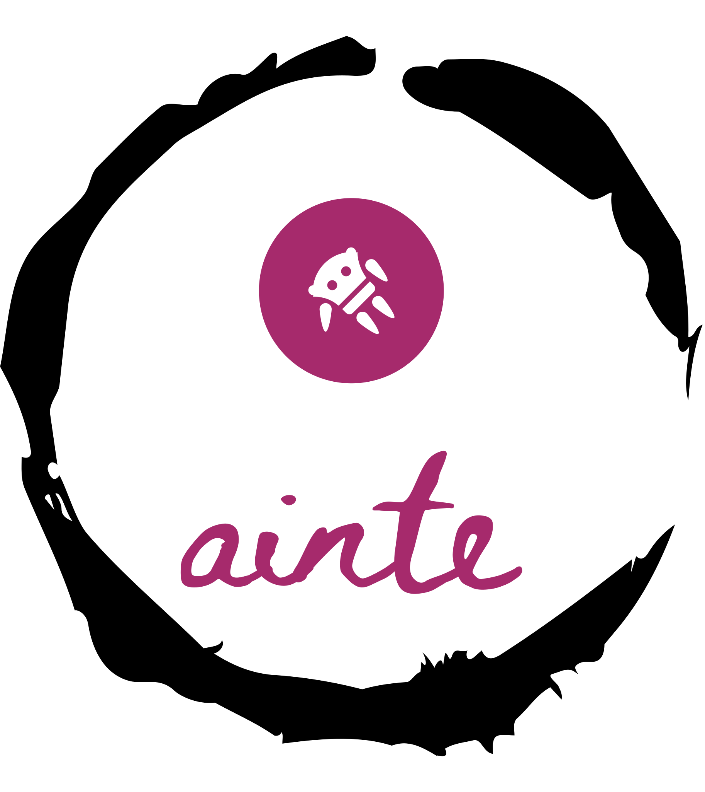

# Ainte

**An illegally-made, genetically-engineered, extraterrestrial lifeform which interacts with Ethereum**

<p align="center">
    
</p>

## What is Ainte

Ainte is a command line tool that allows you to interact with the Ethereum blockchain. It is built with Bun and uses an LLM to generate bash commands for you. It is able to interoperate between the EthereumRPC, the Etherscan API and the foundry tooling to get you the information you need.

## Vision

Interacting with blockchains is currently a complex process. There are two main methods: blockchain explorers and CLI tools. Explorers are great for basic tasks like calling getter functions or viewing simple transactions, but they're limited for more complex operations. On the other hand, CLI tools like Hardhat and Foundry are more powerful, but they can be cumbersome to use. This, the vision is to utilize the power of LLMs to interact with the Ethereum blockchain in a more natural and intuitive way.

Hopefully, this tool can evolve to a one-stop-shop for the blockchain needs of any developer for both everyday tasks like deploying contracts and decoding transactions, as well as more complex tasks like telemetry data analysis and contract fuzzing.

## Status

Currently this is a proof of concept that shows that it is possible to interact with the Ethereum blockchain in a more natural and intuitive way. There is still a lot of work to be done to make this a reality, but the basics are there.

**Namely, it is currently possible to:**

- **Query EthereumRPC for transactions, addresses and more**
    - Get me the latest block.
    - Get me the last 10 transactions of address X.
    - How many transactions are there in block X?
    - Get me the balance of address X.

- **Query the Etherscan API for contract related information**
    - What is the contract name of address X?
    - What is the last transaction of UniswapV3
    - Get me the last 10 events of contract X.
    - What is the contract code of address X?
    - Give me the abi of contract X.
    - Get me the last price of WETH in USD

- **Use cast along with the APIs to perform complex tasks**
    - What's the current gas price in gwei? (Uses the rpc to query the gas_price and converts it to gwei using cast)
    - How many tokens are minted in WETH? (Uses the rpc api to get the totalSupply of WETH and converts it to decimal using cast)
    - Decode the calldata of transaction X (Uses the etherscan api)

- **Answer questions that it already knows the answer to**
    - What is the WETH contract address on Ethereum Sepolia?
    - What is the interface of ERC20?
    - What does the swapExactTokensForTokens does in uniswap?

- **Perform multistep tasks while keeping context from previous steps**
    1. Get me the last uniswap v3 transaction.
    2. Decode the calldata of this transaction.
    3. What is this function call exactly?

    1. Get me the transactions of the latest block
    2. What is the total amount transferred in this block?
    3. Give me this amount in Ether

Apart from these basic functionalities, it also:

* Asks clarifying questions when the task is not well defined.
* Rejects irrelevant questions.
* Corrects itself when the command produced incorrect results.

## Usage

The tool is currently implemented as a Command Line Interface (CLI) that provides a Read-Eval-Print Loop (REPL) for interacting by chat with the assistant. Additionally, the tool supports custom commands, which can be executed by prefixing them with the `/` character. These custom commands offer quick access to specific functionalities outside the normal conversation flow.

**Supported commands:**

- `/exit` - Exits the REPL
- `/menu` - Shows the commands menu
- `/retry` - Keeps trying to fix the previous commands 3 times in case of error
- `/save` - Saves the conversation to a file
- `/copy` - Copies the last output to the clipboard

## Installation (Docker)

1. Copy .env.example to .env and set your `open_ai` key

```bash
docker build -t ainte .
docker run --rm -it -e ASSISTANT_NAME=your-assistants-name ainte
```

## For contributors

This project uses [Bun](https://bun.sh/) as the programming language and package manager. It is recommended to use Bun to run the project.

```bash
bun run dev
```

We'd love to get contributions from the community! Make sure to check the [issues](https://github.com/commonprefix/ainte/issues) and [pull requests](https://github.com/commonprefix/ainte/pulls) to see if there's anything you'd like to work on.